## Contexte

### Odoo

Cette configuration permet d’utiliser la fonction de catchall disponible dans Odoo pour rediriger des courriels vers des objets particuliers de l’application en créant des entrées. Par exemple, création de tâches dans un projet ou bien d’opportunités dans le CRM lorsqu’un courriel est reçu à une adresse pré-déterminée.

Le catchall de Odoo se base sur un fetch des courriels dans la boîte d’un utilisateur Google dédié (appelons-le [user_odoo@macompagnie.com](mailto:user_odoo@macompagnie.com)). Tous les courriels non lus sont analysés par Odoo afin de les rediriger si un alias pré-configuré de l’application est reconnue.

### Gmail

Les différents alias ne sont par contre pas connues de Gmail, puisqu’ils sont configurés directement dans Odoo et que c’est lors de l’arrivée dans Odoo qu’ils sont analysés. Afin de s’assurer que les courriels avec n’importe quel alias configuré dans Odoo atterrisse dans la boîte courriel de l’utilisateur dédié, il faut configurer un catchall du côté de Gmail. Ce catchall permettra d’accepter n’importe quel courriel envoyé avec le bon domaine (par exemple [xxx@macompagnie.com](mailto:xxx@macompagnie.com) ou [yyy@macompagnie.com](mailto:yyy@macompagnie.com), etc.)

## Configuration

La configuration comporte deux manoeuvres:

1. La création du catchall Gmail **(STEPS 1 to 8)**

2. La création d’un alias pour rediriger les courriels du catchall vers [user_odoo@macompagnie.com](mailto:user_odoo@macompagnie.com) **(STEPS 9 to 14)**

**_Suivre les étapes du guide ci-dessous (en Anglais)._**

## STEP 1 – LOGIN TO GOOGLE APPS ADMIN CONSOLE

## STEP 2 - NAVIGATE AND CLICK ON GOOGLE APPS

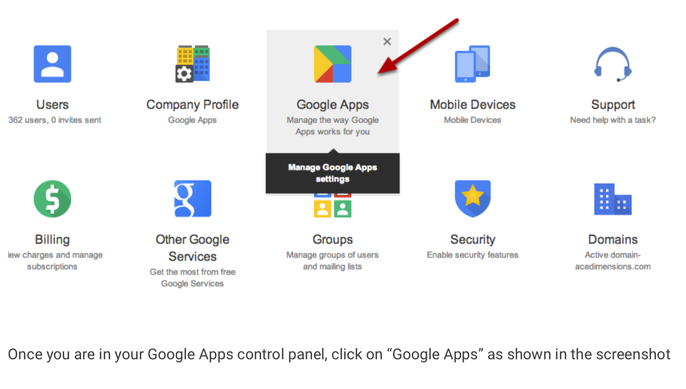

## STEP 3 - NAVIGATE AND CLICK ON GMAIL

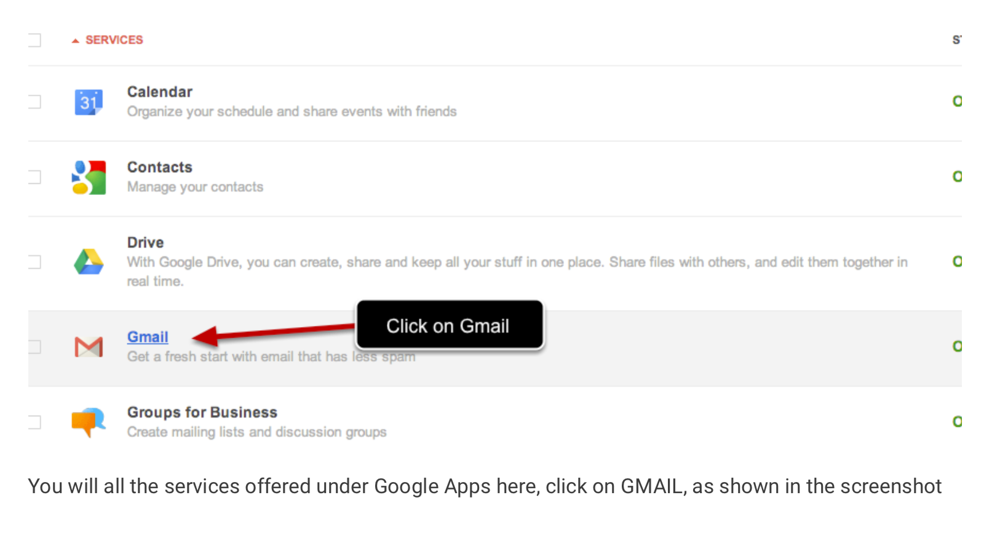

## STEP 4 – NAVIGATE AND CLICK ON DEFAULT ROUTING

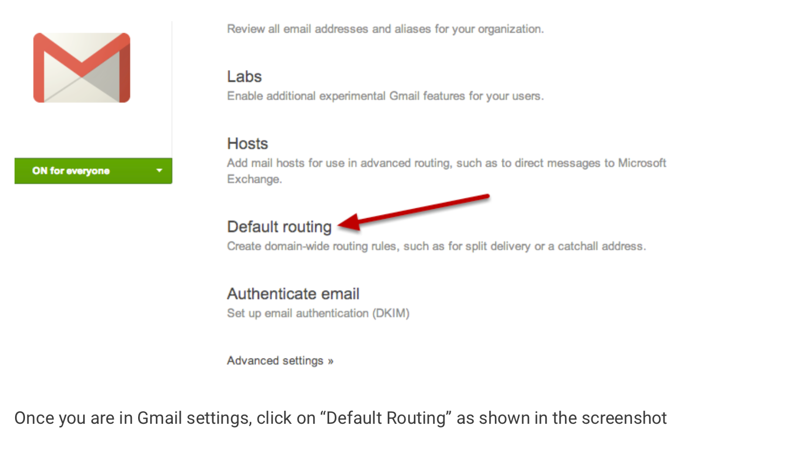				

## STEP 5 – CLICK ON ADD SETTING TO DEFINE RULE

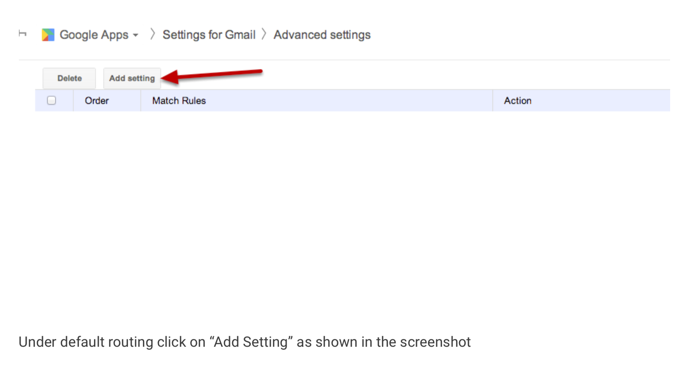		

## STEP 6 – DEFINE ROUTING FOR ALL RECIPIENTS

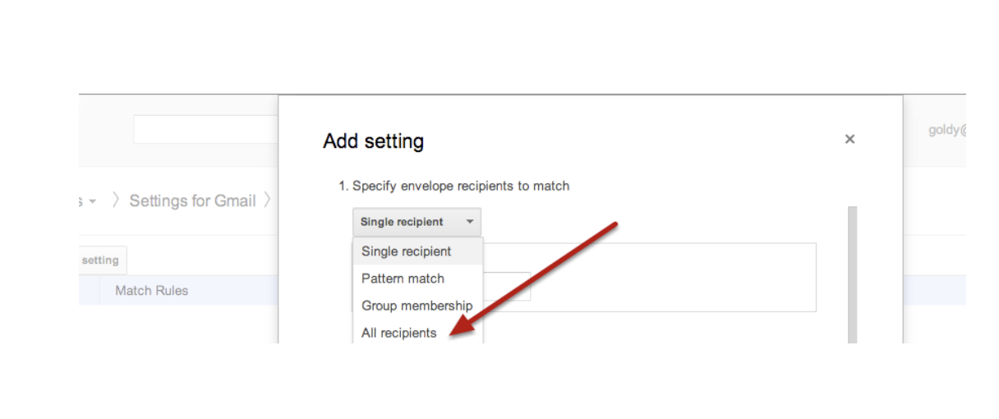

Once you are in your Google Apps control panel, click on Google Apps as shown in the screenshot			

## STEP 7 – CHANGE THE ENVELOPE RECIPIENT WITH YOUR CATCH ALIAS

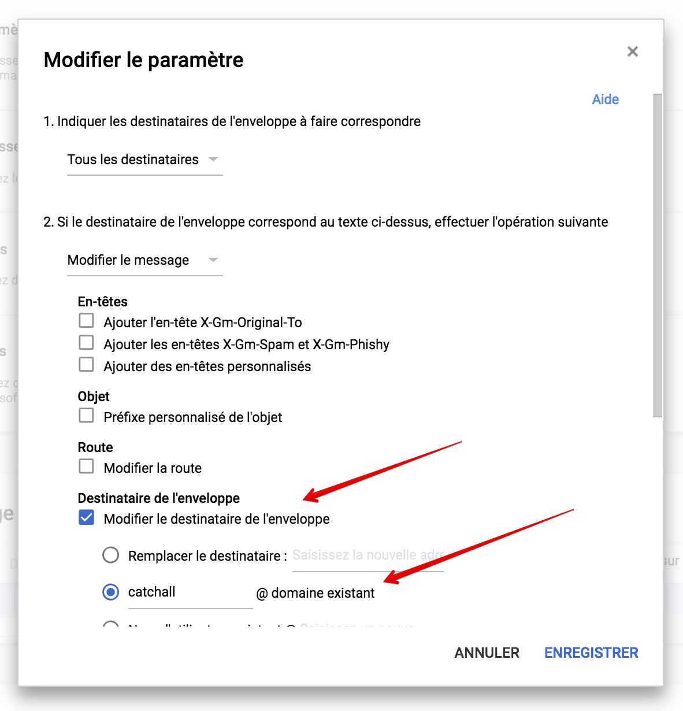

* Choose "Change envelope recipient" (“Modifier le destinataire de l’enveloppe”)

* Input the alias catchall (we will create this alias in the next section)

## STEP 8 - APPLY THIS RULE ONLY FOR USERS WHICH DO NOT EXIST

### 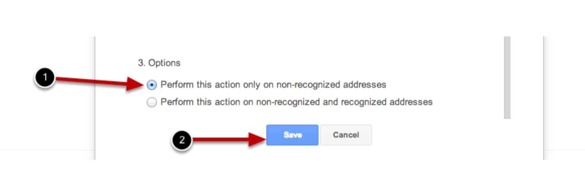

* Choose "Perform this action only on non-reconized addresses

* SAVE

## STEP 9 - NAVIGATE BACK TO THE MAIN MENU

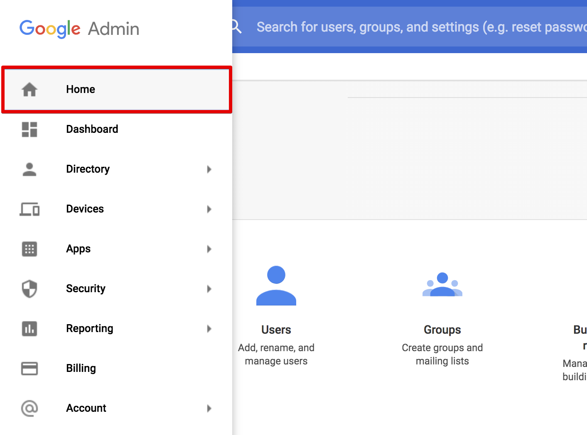

## STEP 10 - NAVIGATE AND CLICK ON USERS

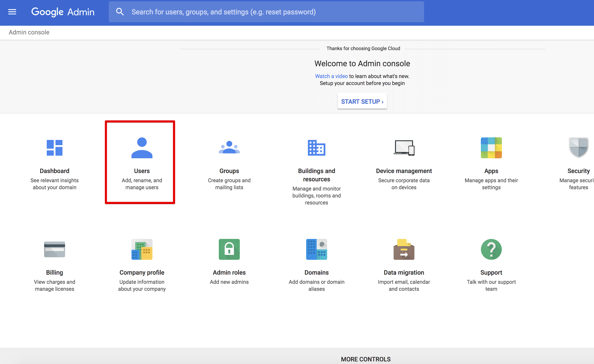

## STEP 11 - SEARCH AND SELECT THE USER THAT WILL BE USED AS AN INBOX

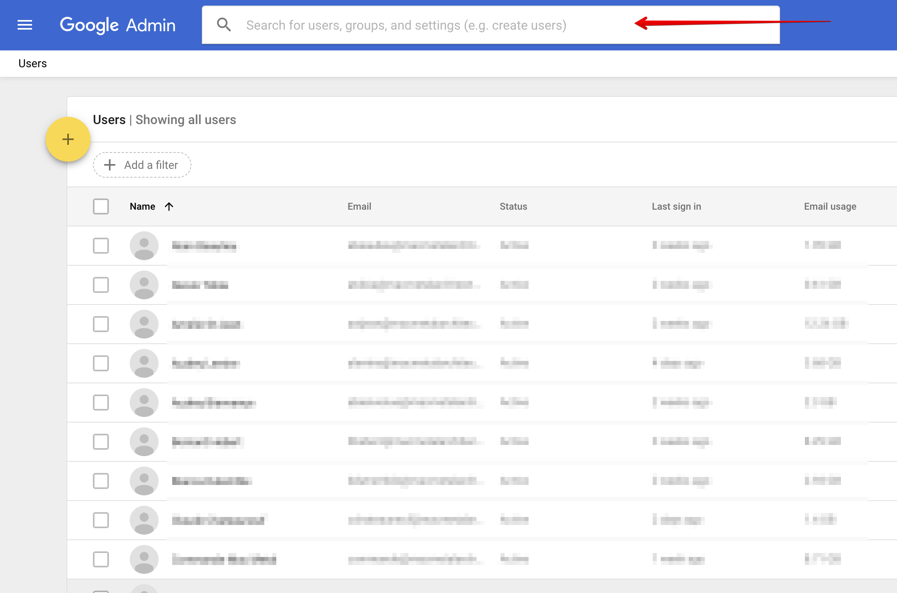

## STEP 12 - NAVIGATE AND CLICK ON USER INFORMATION

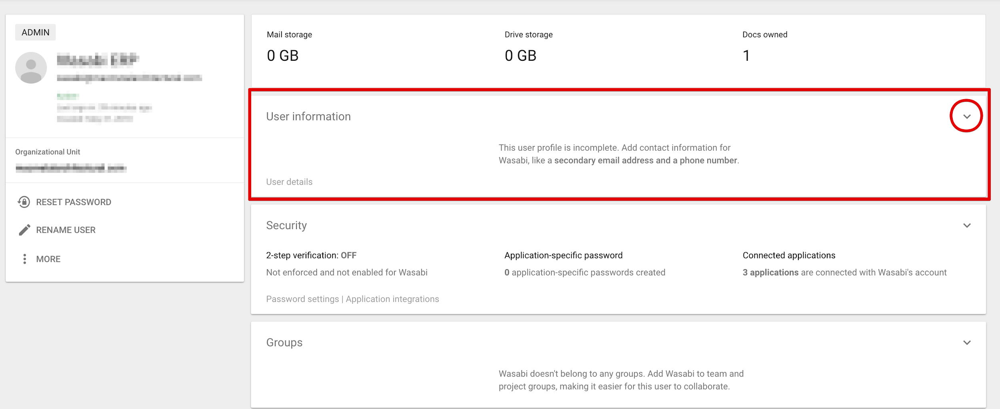

## STEP 13 - NAVIGATE AND CLICK ON EMAIL ALIASES

## STEP 14 - ADD A CATCHALL ALIAS AND SAVE

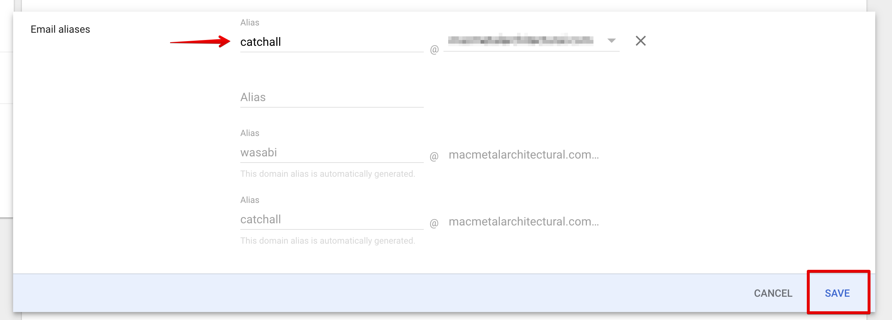

* Add a "catchall" alias for your domain

* SAVE

### YOU ARE DONE! 🎉
